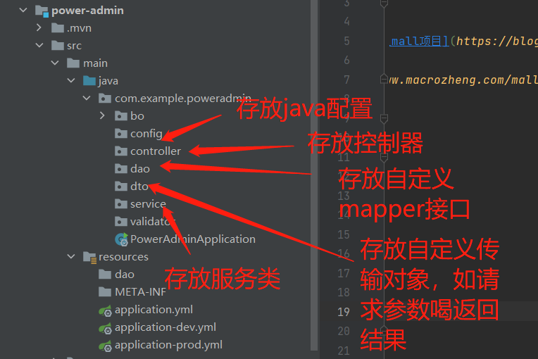

# power e-commerce 后端开发文档

## 参考文档：

[(20条消息) Github开源项目详解--Mall（一）_吃个小菜的博客-CSDN博客_mall项目](https://blog.csdn.net/qq_45714272/article/details/125565042)

[mall架构及功能概览 | mall学习教程 (macrozheng.com)](https://www.macrozheng.com/mall/foreword/mall_foreword_01.html#mall项目简介)

## 后台架构：

```
mall
├── mall-common – 工具类及通用代码
├── mall-mbg – MyBatisGenerator生成的数据库操作代码
├── mall-security – SpringSecurity封装公用模块
├── mall-admin – 后台商城管理系统接口
├── mall-search – 基于Elasticsearch的商品搜索系统
├── mall-portal – 前台商城系统接口
└── mall-demo – 框架搭建时的测试代码
```

#### 总结：

springboot项目，一般大项目都会分成一个父项目，下面多个子项目，子项目是后台web，admin，前台接口portal，或者mgb代码生成之类的。目的：模块之间隔离，修改某一个模块的代码，其他模块不会受到影响。

每一个子项目都有一个自己的pom.xml文件，项目依赖文件。

父项目的pom.xml文件与子项目pom.xml文件的关系：（是继承关系！）

父项目写好全部的依赖，子项目就可以用这些依赖。在这里父项目pom.xml中dependencies和dependencyManager很重要。如果是dependencies中的依赖子项目会自动继承，但是dependencyManager标签中申明的依赖，子项目想要继承就要在自己的pom.xml中写groupId和artifactId去声明。

#### 我学习的文档：

[SpringBoot 多模块项目 - SpringBoot教程 - 基础教程在线 (nhooo.com)](https://www.nhooo.com/springboot/springboot-multi-module-project.html)

[Maven 多模块父子工程的实现(含Spring Boot示例)_java_脚本之家 (jb51.net)](https://www.jb51.net/article/209590.htm)

[(21条消息) Maven学习笔记-父pom和子pom_一片蓝蓝的云的博客-CSDN博客_父pom](https://blog.csdn.net/mumuwang1234/article/details/108679923)

# power e-commerce整合SpringBoot+MyBatis+swagger+redis+SpringSecurity+JWT+SpringTask+Elasticsearch+MongoDB+RabbitMQ+OSS搭建基本骨架

[macrozheng](https://www.macrozheng.com/)2019年5月6日Mall学习教程架构篇SpringBootMyBatis

------

整合SpringBoot+MyBatis搭建基本骨架，实现基本的CRUD操作及通过PageHelper实现分页查询。

## 项目使用框架介绍

### SpringBoot

> SpringBoot可以让你快速构建基于Spring的Web应用程序，内置多种Web容器(如Tomcat)，通过启动入口程序的main函数即可运行。

### PagerHelper

> MyBatis分页插件，简单的几行代码就能实现分页，在与SpringBoot整合时，只要整合了PagerHelper就自动整合了MyBatis。


```java
PageHelper.startPage(pageNum, pageSize);
//之后进行查询操作将自动进行分页
List<PmsBrand> brandList = brandMapper.selectByExample(new PmsBrandExample());
//通过构造PageInfo对象获取分页信息，如当前页码，总页数，总条数
PageInfo<PmsBrand> pageInfo = new PageInfo<PmsBrand>(list);
```

### Druid

> alibaba开源的数据库连接池，号称Java语言中最好的数据库连接池。

### Mybatis generator

> MyBatis的代码生成器，可以根据数据库生成model、mapper.xml、mapper接口和Example，通常情况下的单表查询不用再手写mapper。

## 项目搭建

### 一、使用IDEA初始化一个SpringBoot项目


### 二、添加项目依赖pom.xml文件

> 在pom.xml中添加相关依赖。

```xml
<?xml version="1.0" encoding="UTF-8"?>
<project xmlns="http://maven.apache.org/POM/4.0.0" xmlns:xsi="http://www.w3.org/2001/XMLSchema-instance"
         xsi:schemaLocation="http://maven.apache.org/POM/4.0.0 https://maven.apache.org/xsd/maven-4.0.0.xsd">
    <modelVersion>4.0.0</modelVersion>

    <!--本项目的信息-->
    <groupId>com.example</groupId>
    <artifactId>power_e-commerce</artifactId>
    <version>0.0.1-SNAPSHOT</version>
    <name>power_e-commerce</name>
    <description>Demo project for Spring Boot</description>
    <properties>
        <java.version>1.8</java.version>
    </properties>

    <!--导入子项目到父项目使用-->
    <modules>
        <module>power-admin</module>
        <module>power-common</module>
        <module>power-demo</module>
        <module>power-mbg</module>
        <module>power-portal</module>
        <module>power-search</module>
        <module>power-security</module>
    </modules>

    <parent>
        <groupId>org.springframework.boot</groupId>
        <artifactId>spring-boot-starter-parent</artifactId>
        <version>2.7.3</version>
        <relativePath/> <!-- lookup parent from repository -->
    </parent>

    <properties>
        <project.build.sourceEncoding>UTF-8</project.build.sourceEncoding>
        <project.reporting.outputEncoding>UTF-8</project.reporting.outputEncoding>
        <java.version>1.8</java.version>
        <skipTests>true</skipTests>
        <docker.host>http://192.168.3.105:2375</docker.host>
        <docker.maven.plugin.version>0.40.0</docker.maven.plugin.version>
        <pagehelper-starer.version>1.4.2</pagehelper-starer.version>
        <pagehelper.version>5.3.0</pagehelper.version>
        <druid.version>1.2.9</druid.version>
        <hutool.version>5.8.0</hutool.version>
        <springfox-swagger.version>3.0.0</springfox-swagger.version>
        <swagger-models.version>1.6.0</swagger-models.version>
        <swagger-annotations.version>1.6.0</swagger-annotations.version>
        <mybatis-generator.version>1.4.1</mybatis-generator.version>
        <mybatis.version>3.5.9</mybatis.version>
        <mysql-connector.version>8.0.29</mysql-connector.version>
        <spring-data-commons.version>2.7.0</spring-data-commons.version>
        <jjwt.version>0.9.1</jjwt.version>
        <aliyun-oss.version>2.5.0</aliyun-oss.version>
        <logstash-logback.version>7.2</logstash-logback.version>
        <minio.version>8.4.1</minio.version>
        <mall-common.version>0.0.1-SNAPSHOT</mall-common.version>
        <mall-mbg.version>0.0.1-SNAPSHOT</mall-mbg.version>
        <mall-security.version>0.0.1-SNAPSHOT</mall-security.version>
    </properties>

    <!--项目依赖-->
    <dependencies>
        <!--springboot的通用依赖模块 starter (web,actuator,aop,test) -->
        <dependency>
            <groupId>org.springframework.boot</groupId>
            <artifactId>spring-boot-starter-web</artifactId>
        </dependency>
        <dependency>
            <groupId>org.springframework.boot</groupId>
            <artifactId>spring-boot-starter-actuator</artifactId>
        </dependency>
        <dependency>
            <groupId>org.springframework.boot</groupId>
            <artifactId>spring-boot-starter-aop</artifactId>
        </dependency>
        <dependency>
            <groupId>org.springframework.boot</groupId>
            <artifactId>spring-boot-starter-test</artifactId>
            <scope>test</scope>
        </dependency>
        <dependency>
            <groupId>org.springframework.boot</groupId>
            <artifactId>spring-boot-configuration-processor</artifactId>
            <optional>true</optional>
        </dependency>

        <!--MyBatis分页插件-->
        <dependency>
            <groupId>com.github.pagehelper</groupId>
            <artifactId>pagehelper-spring-boot-starter</artifactId>
            <version>1.4.2</version>
        </dependency>

        <!--集成druid连接池 druid是阿里公司的，java中的数据库连接池-->
        <dependency>
            <groupId>com.alibaba</groupId>
            <artifactId>druid-spring-boot-starter</artifactId>
            <version>1.2.9</version>
        </dependency>

        <!--MyBatis 生成器-->
        <dependency>
            <groupId>org.mybatis.generator</groupId>
            <artifactId>mybatis-generator-core</artifactId>
            <version>1.4.1</version>
        </dependency>

        <!--mysql数据库驱动-->
        <dependency>
            <groupId>mysql</groupId>
            <artifactId>mysql-connector-java</artifactId>
            <version>8.0.15</version>
        </dependency>

        <!--lombok依赖-->
        <dependency>
            <groupId>org.projectlombok</groupId>
            <artifactId>lombok</artifactId>
            <optional>true</optional>
        </dependency>

        <!--hutool中有很多java的类-->
        <dependency>
            <groupId>cn.hutool</groupId>
            <artifactId>hutool-all</artifactId>
            <version>5.8.0</version>
        </dependency>

    </dependencies>

    <dependencyManagement>
        <dependencies>
            <!--power通用模块-->
            <!--common是power中工具类模块-->
            <dependency>
                <groupId>com.example</groupId>
                <artifactId>power-common</artifactId>
                <version>${power-common.version}</version>
            </dependency>
            <!--mgb是power中的MBG生成模块-->
            <dependency>
                <groupId>com.example</groupId>
                <artifactId>power-mbg</artifactId>
                <version>${power-mbg.version}</version>
            </dependency>
            <!--power项目中的安全模块-->
            <dependency>
                <groupId>com.example</groupId>
                <artifactId>power-security</artifactId>
                <version>${power-security.version}</version>
            </dependency>
            <!--MyBatis分页插件starter-->
            <dependency>
                <groupId>com.github.pagehelper</groupId>
                <artifactId>pagehelper-spring-boot-starter</artifactId>
                <version>${pagehelper-starter.version}</version>
            </dependency>
            <!--MyBatis分页插件-->
            <dependency>
                <groupId>com.github.pagehelper</groupId>
                <artifactId>pagehelper</artifactId>
                <version>${pagehelper}</version>
            </dependency>
            <!--集成druid连接池-->
            <dependency>
                <groupId>com.alibaba</groupId>
                <artifactId>druid-spring-boot-starter</artifactId>
                <version>${druid.version}</version>
            </dependency>
            <!--Hutool Java工具包-->
            <dependency>
                <groupId>cn.hutool</groupId>
                <artifactId>hutool-all</artifactId>
                <version>${hutool.version}</version>
            </dependency>
            <!--Swagger-UI API文档生产工具-->
            <dependency>
                <groupId>io.springfox</groupId>
                <artifactId>springfox-boot-starter</artifactId>
                <version>${spring-swagger.version}</version>
            </dependency>
            <!--解决Swagger访问主页时的NumberFormatException问题-->
            <dependency>
                <groupId>io.swagger</groupId>
                <artifactId>swagger-models</artifactId>
                <version>${swagger-models.version}</version>
            </dependency>
            <dependency>
                <groupId>io.swagger</groupId>
                <artifactId>swagger-annotations</artifactId>
                <version>${swagger-annotations.version}</version>
            </dependency>
            <!--MyBatis 生成器-->
            <dependency>
                <groupId>org.mybatis.generator</groupId>
                <artifactId>mybatis-generator-core</artifactId>
                <version>${mybatis-generator.version}</version>
            </dependency>
            <!--MyBatis-->
            <dependency>
                <groupId>org.mybatis</groupId>
                <artifactId>mybatis</artifactId>
                <version>${mybatis.version}</version>
            </dependency>
            <!--Mysql数据库驱动包-->
            <dependency>
                <groupId>mysql</groupId>
                <artifactId>mysql-connector-java</artifactId>
                <version>${mysql-connector.version}</version>
            </dependency>
            <!--SpringData工具包-->
            <dependency>
                <groupId>org.springframework.data</groupId>
                <artifactId>spring-data-commons</artifactId>
                <version>${spring-data-commons.version}</version>
            </dependency>
            <!--JWT（Json Web Token）登录支持-->
            <dependency>
                <groupId>io.jsonwebtoken</groupId>
                <artifactId>jjwt</artifactId>
                <version>${jjwt.version}</version>
            </dependency>
            <!--阿里云OSS  对象存储服务-->
            <dependency>
                <groupId>com.aliyun.oss</groupId>
                <artifactId>aliyun-sdk-oss</artifactId>
                <version>${aliyun-oss.version}</version>
            </dependency>
            <!--集成logstash-->
            <dependency>
                <groupId>net.logstash.logback</groupId>
                <artifactId>logstash-logback-encoder</artifactId>
                <version>7.2</version>
            </dependency>
            <!--MinIO JAVA SDK-->
            <dependency>
                <groupId>io.minio</groupId>
                <artifactId>minio</artifactId>
                <version>${minio.version}</version>
            </dependency>
        </dependencies>
    </dependencyManagement>

    <build>
        <pluginManagement>
            <plugins>
                <plugin>
                    <groupId>org.springframework.boot</groupId>
                    <artifactId>spring-boot-maven-plugin</artifactId>
                </plugin>
                <plugin>
                    <groupId>io.fabric8</groupId>
                    <artifactId>docker-maven-plugin</artifactId>
                    <version>${docker.maven.plugin.version}</version>
                        <executions>
                            <!--如果想在项目打包时构建镜像添加-->
                            <execution>
                                <id>build-iamge</id>
                                <phase>package</phase>
                                <goals>
                                    <goal>build</goal>
                                </goals>
                            </execution>
                        </executions>
                    <configuration>
                        <!--Docker 远程管理地址-->
                        <dockerHost>${docker.host}</dockerHost>
                        <images>
                            <image>
                                <!--定义镜像名称-->
                                <name>power/${project.name}:${project.version}</name>
                                <!--定义镜像构建行为-->
                                <build>
                                    <!--定义基础镜像-->
                                    <from>java:8</from>
                                    <args>
                                        <JAR_FILE>${project.build.finalName}.jar</JAR_FILE>
                                    </args>
                                    <!--定义哪些文件拷贝到容器中-->
                                    <assembly>
                                        <!--定义拷贝到容器的目录-->
                                        <targetDir>/</targetDir>
                                        <!--只拷贝生成的jar包-->
                                        <descriptorRef>artifact</descriptorRef>
                                    </assembly>
                                    <!--定义容器启动命令-->
                                    <enetyPoint>["java","-jar","-Dspring.profiles.active=prod","/"${project.build.finalName}.jar]</enetyPoint>
                                    <!--定义维护者-->
                                    <maintainer>shevinfy</maintainer>
                                </build>
                            </image>
                        </images>
                    </configuration>
                </plugin>
            </plugins>
        </pluginManagement>
    </build>

</project>

```

#### groupId与artifactId：

groupId：是项目组织唯一的标识符，实际对应java包的结构，是main目录里java的目录结构
artifactId：就是项目唯一的标识符，实际项目的名称

groupId一般分为多个段，这里只说两段，第一段为域，第二段为公司名称。域又分为org、com、cn等等许多，其中org为非盈利阻止，com为商业阻止。比如apache公司的tomcat项目，groupId为org.apache，它的域为org，公司名称为apache，artifactId为tomcat

#### OSS：

OSS是阿里云对象存储服务（Object Storage Service）的一个简称，它是阿里云提供的海量、安全、低成本、高可靠的云存储服务。
即开即用、无限大空间的存储集群。相较传统建服务器存储而言，OSS在可靠性、安全性、成本和数据处理能力方面都有着突出的优势。使用OSS，您可以通过网络随时存储和调用包括文本、图片和视频等在内的各种非结构化数据文件。
OSS将数据文件以对象/文件（Object）的形式上传到存储空间（Bucket）中。OSS提供的是一个Key-Value键值对形式的对象存储服务。用户可以根据Object的名称（Key）唯一地址获取该Object的内容。

#### logstash：

logstash就是一根具备实时数据传输能力的管道，负责将数据信息从管道的输入端传输到管道的输出端；与此同时这根管道还可以让你根据自己的需求在中间加上滤网，Logstash提供里很多功能强大的滤网以满足你的各种应用场景。

logstash常用于日志系统中做日志采集设备，最常用于ELK中作为日志收集器使用。

#### MinIo java SDK：

MinIO 是一款基于Go语言发开的高性能、分布式的对象存储系统。客户端支持Java,Net,Python,Javacript, Golang语言。

MinIO 是一款高性能、**分布式的对象存储系统**. 它是一款软件产品, 可以100%的运行在标准硬件。

### 三、修改power-admin的SpringBoot配置文件

yml文件分为application.yml，application-dev.yml，application-prod.yml

#### 1、application.yml是总的

> 在application.yml中添加数据源配置和MyBatis的mapper.xml的路径配置。

```yaml
spring:
  application:
    name: power-search  #应用程序名称
  profiles:
    active: dev #默认为开发环境

  #springboot升级到2.6之后，需要设置spring.mvc.pathmatch.matching-strategy来兼容Swagger2
  mvc:
    pathmatch:
      matching-strategy: ant_path_matcher


server:
  port: 8081  # 服务器配置

# 配置Scanner扫描器
mybatis:
  mapper-locations: # 配置多个扫描路径
    - classpath:dao/*.xml
    - classpath*:com/**/mapper/*/xml
```

##### 1.1、spring.mvc.pathmatch.matching-strategy:

由于**Spring Boot 2.6.x** 请求路径与 Spring MVC 处理映射匹配的默认策略从`AntPathMatcher`更改为`PathPatternParser`。所以需要设置`spring.mvc.pathmatch.matching-strategy为ant-path-matcher`来改变它。

##### 1.2、mybatis的springboot使用：

pom

```xml
<dependency>
    <groupId>org.mybatis.spring.boot</groupId>
    <artifactId>mybatis-spring-boot-starter</artifactId>
</dependency>
```

如果使用了pagehelper的starter，则可以只导入如下的Maven库即可

```xml
<dependency>
    <groupId>com.github.pagehelper</groupId>
    <artifactId>pagehelper-spring-boot-starter</artifactId>
</dependency>
```

在配置类中定义接口扫描范围

```java
@Configuration
@EnableTransactionManagement
@MapperScan({"com.test.mapper","com.test.portal.dao"})
public class MyBatisConfig {
}
```

@Configuration用于指定该类为配置入口类
可以在MappderScan中定义多个接口包名
@EnableTransactionManagement是用于开启事务的

在yml中配置Scanner扫描器

```yml
mybatis:
  mapper-locations:
    - classpath:dao/*.xml
    - classpath*:com/**/mapper/*.xml
```

可以配置多个扫描路径

#### 2、application-dev.yml 开发环境

```yml
spring:
  datasource: #配置jdbc数据源
    url: jdbc:mysql://localhost:3306/power?useUnicode=true&characterEncoding=utf-8&serverTimezone=Asiz/Shanghai&useSSL=false
    username: root
    userword: xwwfy
    druid:  # 可以是c3p0，dbcp或者druid、HikariCP等任意数据源
      initial-size: 5 #连接池初始化大小
      min-idle: 10 #最小空闲连接数
      max-active: 20 #最大连接数
      web-stat-filter: # 这个过滤器的作用就是统计web应用请求中所有的数据库信息
        exclusions: "*.js,*.gif,*.jpg,*.png,*.css,*ico,/druid/*" #不统计这些请求数据
      stat-view-servlet: #访问监控网页的登录用户名和密码
        login-username: druid
        login-password: druid

  data:
    elasticsearch:
      repositories: # 开启Repository模式
        enabled: true
  elesticsearch:
    uris: localhost:9200

# 修改日志级别
logging:
  level:
    # 设置日志的默认级别为 info
    root: info
    # 设置com.example.poweradmin包下的日志级别是debug
    com.example.poweradmin: debug
  # 指定日志文件输出
  file:
    name: F:\java_project\mall\shevinfy_power_e-commerce\power e-commerce\document\log\poweradmin_log.txt

logstash:
  host: localhost
  enableInnerLog: false

```

##### 2.1、druid配置

**配置Druid数据源（连接池）：** 如同以前 c3p0、dbcp 数据源可以设置数据源连接初始化大小、最大连接数、等待时间、最小连接数 等一样，Druid 数据源同理可以进行设置；

**配置 Druid web 监控 filter（WebStatFilter）：** **这个过滤器的作用就是统计 web 应用请求中所有的数据库信息**，比如 发出的 sql 语句，sql 执行的时间、请求次数、请求的 url 地址、以及seesion 监控、数据库表的访问次数 等等。

**配置 Druid 后台管理 Servlet（StatViewServlet）：** Druid 数据源具有监控的功能，并提供了一个 web 界面方便用户查看，类似安装 路由器 时，人家也提供了一个默认的 web 页面；需要设置 Druid 的后台管理页面的属性，比如 **登录账号、密码**等；

##### 2.2、elasticsearch：

Elasticsearch 是一个基于Lucene的分布式、高扩展、高实时的搜索与数据分析引擎，常被用作**全文检索、结构化搜索、分析**以及这三个功能的组合。它可以被下面这样准确的形容：

- 一个分布式的实时文档存储，**每个字段 可以被索引与搜索**
- 一个分布式**实时分析搜索引擎**
- 能胜任上百个服务节点的扩展，并支持 PB 级别的结构化或者非结构化数据
  

##### 2.3.配置jdbc数据源

可以是c3p0、dbcp或者druid、HikariCP等任意数据源

```yml
spring:
  datasource:
    url: jdbc:mysql://192.168.9.51:3306/testdb
    username: root
    password: 123456
    druid:
      initial-size: 5 #连接池初始化大小
      min-idle: 10 #最小空闲连接数
      max-active: 20 #最大连接数
```

#### 3、applicattion-prov.yml 生产环境

```yml
spring:
  datasource:
    url: jdbc:mysql://db:3306/power?useUnicode=ture&characterEncoding=utf-8&serverTimezone=Asia/Shanghai&useSSL=false
    username: root
    password: xwwfy

    druid:
      inttial-size: 5 #连接池初始化大小
      min-idle: 10 #最小空闲连接数
      max-active: 20 #最大连接数
      web-stat-filter:
        exclusions: "*.jpg,*.png,*.gif,*.css,*.js,*.ico,/druid/*" #不统计这些请求数据
      stat-view-servlet: #访问监控网页的登录用户名和密码
        login-username: druid
        login-password: druid

  data:
    elasticsearch:
      repositories:
        enabled: true
  elasticsearch:
      uris: es:9200

logging:
  file:
    path: /var/logs
  level:
    root: info
    com.example.power: info

logstash:
  host: logstash
```

与dev基本一样，有一些细节配置改一下就好了，比如：接口都要改成上线服务器的地址。文件位置也是服务器的位置。

### 项目结构说明

先写poweradmin



## power-mbg（MyBatis搭建基本骨架）

### 参考资料：

[MyBatis：Mybatis逆向工程问题记录 - 怒吼的萝卜 - 博客园 (cnblogs.com)](https://www.cnblogs.com/nhdlb/p/10904567.html)

generetorConfig配置文件详细介绍：[(21条消息) generatorConfiguration配置详解_无形风的博客-CSDN博客_generatorconfig配置](https://blog.csdn.net/xukaiqiang123/article/details/125993327)

==写每一个子模块的时候都要先写pom.xml依赖配置文件，导入对应的依赖==

### pom.xml（power-admin）：

```xml
<?xml version="1.0" encoding="UTF-8"?>
<project xmlns="http://maven.apache.org/POM/4.0.0" xmlns:xsi="http://www.w3.org/2001/XMLSchema-instance"
         xsi:schemaLocation="http://maven.apache.org/POM/4.0.0 https://maven.apache.org/xsd/maven-4.0.0.xsd">
    <modelVersion>4.0.0</modelVersion>
    <parent>
        <groupId>com.example</groupId>
        <artifactId>power_e-commerce</artifactId>
        <version>0.0.1-SNAPSHOT</version>
        <relativePath/> <!-- lookup parent from repository -->
    </parent>

    <groupId>com.example</groupId>
    <artifactId>power-mbg</artifactId>
    <version>0.0.1-SNAPSHOT</version>

    <name>power-mbg</name>
    <description>power-mbg project for power_e-commerce</description>

    <dependencies>
        <!--通用类依赖导入-->
        <dependency>
            <groupId>com.example</groupId>
            <artifactId>power-common</artifactId>
        </dependency>
        <!--分页依赖-->
        <dependency>
            <groupId>com.github.pagehelper</groupId>
            <artifactId>pagehelper-spring-boot-starter</artifactId>
        </dependency>
        <!--java与数据库连接池druid-->
        <dependency>
            <groupId>com.alibaba</groupId>
            <artifactId>druid-spring-boot-starter</artifactId>
        </dependency>
        <!--mybatis代码生成器mybatis generator-->
        <dependency>
            <groupId>org.mybatis.generator</groupId>
            <artifactId>mybatis-generator-core</artifactId>
        </dependency>
        <!--java连接mysql-->
        <dependency>
            <groupId>mysql</groupId>
            <artifactId>mysql-connector-java</artifactId>
        </dependency>
    </dependencies>
    
</project>


```

#### pom.xml（power-mbg）文件总结：

我们是mybatis的自动生成代码子模块，

- 需要mybatis的依赖，
- 连接数据库，需要mysql-connection-java依赖，
- 数据库缓存druid依赖。
- 分页依赖，
- 通用类依赖。
- 和每一个子模块都要引入父项目的pom.xml文件

### Mybatis generator 配置文件

### 1.generatorConfig.xml配置文件

> 配置数据库连接，Mybatis generator生成model、mapper接口及mapper.xml的路径。

```xml
<?xml version="1.0" encoding="UTF-8"?>
<!DOCTYPE generatorConfiguration
        PUBLIC "-//mybatis.org//DTD MyBatis Generator Configuration 1.0//EN"
        "http://mybatis.org/dtd/mybatis-generator-config_1_0.dtd">

<generatorConfiguration>
    <!--绑定generator.properties配置-->
    <properties resource="generator.properties"/>
    <context id="MySqlContext" targetRuntime="MyBatis3" defaultModelType="flat">
        <!--property（所有物）添加分隔符，设置编码-->
            <!--begin和end默认双引号mysql要用单引号-->
            <property name="beginningDelimiter" value="`"/>
            <property name="endingDelimiter" value="`"/>
            <!--特殊指定编码-->
            <property name="javaFileEncoding" value="UTF-8"/>
        <!--plugin（插件）修改或者扩展MBG生成的代码-->
            <!--为模型生成序列化方法-->
            <plugin type="org.mybatis.generator.plugins.SerializablePlugin"/>
            <!--为生成的Java模型创建一个toString方法-->
            <plugin type="org.mybatis.generator.plugins.ToStringPlugin"/>
            <!--生成mapper.xml时覆盖原文件-->
            <plugin type="org.mybatis.generator.plugins.UnmergeableXmlMappersPlugin" />
        <!--commentGenerator（评论生成器）-->
            <commentGenerator type="com.example.power.CommentGenerator">
                <!--是否去除自动生成的注释 true 是  false 否-->
                <property name="suppressAllComments" value="true"/>
                <!--是否去除自动生成注释时间 true 是 false 否-->
                <property name="suppressDate" value="true"/>
                <property name="addRemarkComments" value="true"/>
            </commentGenerator>
        <!--jdbc-->
            <jdbcConnection driverClass="${jdbc.driverClass}"
                            connectionURL="${jdbc.connectionURL}"
                            userId="${jdbc.userId}"
                            password="${jdbc.password}">
                    <!--解决mysql驱动升级到8.0后不生成指定数据库代码的问题-->
                    <property name="nullCatalogMeansCurrent" value="true"/>
            </jdbcConnection>
        <!--控制生成的实体类-->
            <javaModelGenerator targetPackage="com.example.powermbg.model" targetProject="power-mbg\src\main\java"/>
        <!--我们的targetRunTime目标是MyBatis3  如果指定了sqlMapGenerator  MBG就会生成xml的SQL映射文件和实体类-->
            <sqlMapGenerator targetPackage="com.example.powermbg.mapper" targetProject="power-mbg\src\main\resources"/>
        <!--如果不配置该元素，就不会生成Mapper接口-->
            <javaClientGenerator type="XMLMAPPER" targetPackage="com.example.powermbg.mapper"
                                 targetProject="power-mbg\src\main\java"/>
        <!--配置通过内省的表，只有配置的才会生成实体类和其他文件-->
            <table tableName="%">       <!--生成全部表tableName设为%-->
                <generatedKey column="id" sqlStatement="Mysql" identity="true" />
            </table>
    </context>
</generatorConfiguration>

```


#### properties元素：

这个元素用来指定外部的属性元素，不是必须的元素。通过resource或者url来指定属性文件的位置

#### 子元素：

这些子元素（有严格的配置顺序）包括：

```xml
<property> (0个或多个)
<plugin> (0个或多个)
<commentGenerator> (0个或1个)
<jdbcConnection> (1个)
<javaTypeResolver> (0个或1个)
<javaModelGenerator> (1个)
<sqlMapGenerator> (0个或1个)
<javaClientGenerator> (0个或1个)
<table> (1个或多个)
```

**反单引号(`)\**就是\**分隔符**，**分隔符**可以用于**表名**或者**列名**。

##### property标签支持的属性：

```
autoDelimitKeywords
beginningDelimiter
endingDelimiter
javaFileEncoding
javaFormatter
xmlFormatter

autoDelimitKeyword：当表名或者字段名为SQL关键字的时候，可以设置该属性为true，MBG会自动给表名或字段名添加分隔符。

beginningDelimiter和endingDelimiter属性：
由于beginningDelimiter和endingDelimiter的默认值为双引号(")，在Mysql中不能这么写，所以还要将这两个默认值改为反单引号(`)，配置如下：

属性javaFileEncoding设置要使用的Java文件的编码，默认使用当前平台的编码，只有当生产的编码需要特殊指定时才需要使用，一般用不到。

最后两个javaFormatter和xmlFormatter属性可能会很有用，如果你想使用模板来定制生成的java文件和xml文件的样式，你可以通过指定这两个属性的值来实现。
```

#####  plugin 元素：

元素用来**定义一个插件**。插件用于**扩展或修改**通过MyBatis Generator (MBG)==代码生成器生成的代码==。

##### commentGenerator元素：

该元素最多可以配置1个。

这个元素非常有用，相信很多人都有过这样的需求，就是希望MBG生成的代码中可以包含**注释信息**，具体就是生成表或字段的备注信息。

默认的实现类中提供了两个可选属性，需要通过属性进行配置。

```
suppressAllComments:**阻止**生成注释，默认为false
suppressDate:**阻止**生成的注释包含时间戳，默认为false
```

#####  jdbcConnection 元素：

用于指定数据库连接信息，该元素必选，并且只能有一个。

配置该元素只需要注意如果JDBC驱动不在**classpath**下，就需要通过元素引入jar包，这里**推荐**将jar包放到**classpath**下。

该元素有两个必选属性:

```
driverClass:访问数据库的JDBC驱动程序的完全限定类名
connectionURL:访问数据库的JDBC连接URL
12
```

该元素还有两个可选属性:

```
userId:访问数据库的用户ID
password:访问数据库的密码
```

##### javaModelGenerator 元素：

该元素必须配置一个，并且最多一个。

该元素用来控制生成的实体类，根据中配置的defaultModelType，一个表可能会对应生成多个不同的实体类。一个表对应多个类实际上并不方便，所以前面也推荐使用flat，这种情况下一个表对应一个实体类。

该元素只有两个属性，都是必选的。

```
targetPackage:生成实体类存放的包名，一般就是放在该包下。实际还会受到其他配置的影响(<table>中会提到)。
targetProject:指定目标项目路径，可以是绝对路径或相对路径（如 targetProject="src/main/java"）
```

#####  sqlMapGenerator元素

该元素可选，最多配置一个。但是有如下两种必选的特殊情况：

```xml
如果targetRuntime目标是**iBATIS2**，该元素必须配置一个。
如果targetRuntime目标是**MyBatis3**，只有当<javaClientGenerator>需要XML时，该元素必须配置一个。 如果没有配置<javaClientGenerator>，则使用以下的规则：
    如果指定了一个<sqlMapGenerator>，那么MBG将只生成XML的SQL映射文件和实体类。
    如果没有指定<sqlMapGenerator>，那么MBG将只生成实体类。
1234
```

该元素只有两个属性（和前面提过的的属性含义一样），都是必选的。

```
targetPackage:生成实体类存放的包名，一般就是放在该包下。实际还会受到其他配置的影响(<table>中会提到)。
targetProject:指定目标项目路径，可以是绝对路径或相对路径（如 targetProject="src/main/resource
```

#####  javaClientGenerator 元素：

该元素可选，最多配置一个。

如果不配置该元素，就不会生成Mapper接口。

##### table 元素：

该元素至少要配置一个，可以配置多个。

该元素用来配置要通过内省的表。只有配置的才会生成实体类和其他文件。

该元素有一个必选属性：

```
tableName：指定要生成的表名，可以使用SQL通配符匹配多个表。
1
```

例如要生成全部的表，可以按如下配置：

```java
<table tableName="%" />
```

### 2.generator.properties

```properties
jdbc.driverClass=com.mysql.cj.jdbc.Driver
jdbc.connectionURL=jdbc:mysql://localhost:3306/power?useUnicode=true&characterEncoding=utf-8&serverTimezone=Asia/Shanghai
jdbc.userId=root
jdbc.password=xwwfy
```


### 3.Generator类（可运行类）

运行Generator的main函数生成代码

```java
package com.example.powermbg;

import org.mybatis.generator.api.MyBatisGenerator;
import org.mybatis.generator.config.Configuration;
import org.mybatis.generator.config.xml.ConfigurationParser;
import org.mybatis.generator.internal.DefaultShellCallback;

import java.io.InputStream;
import java.util.ArrayList;
import java.util.List;

public class Generator {
    public static void main(String[] args) throws Exception{
        // MBG 执行过程中的警告信息
        List<String> warnings = new ArrayList<String>();
        // 当生成代码重复时，覆盖原代码
        boolean overwrite = true;
        // 读取我们的MBG配置文件
        InputStream is = Generator.class.getResourceAsStream("/generatorConfig.xml");
        ConfigurationParser cp = new ConfigurationParser(warnings);
        Configuration config = cp.parseConfiguration(is);
        is.close();

        DefaultShellCallback callback = new DefaultShellCallback(overwrite);
        // 创建 MBG
        MyBatisGenerator myBatisGenerator = new MyBatisGenerator(config,callback,warnings);
        // 执行生成代码
        myBatisGenerator.generate(null);
        // 输出警告信息
        for (String warning:warnings
             ) {
            System.out.println(warning);
        }

    }
}
```

### 4.CommentGenerator.java(mybatis代码自动生成 自定义注解生成)

```java
package com.example.powermbg;

import org.mybatis.generator.api.IntrospectedColumn;
import org.mybatis.generator.api.IntrospectedTable;
import org.mybatis.generator.api.dom.java.CompilationUnit;
import org.mybatis.generator.api.dom.java.Field;
import org.mybatis.generator.api.dom.java.FullyQualifiedJavaType;
import org.mybatis.generator.internal.DefaultCommentGenerator;
import org.mybatis.generator.internal.util.StringUtility;

import java.util.Properties;

/**
 *  自定义注释生成器
 *  继承默认DefaultCommentGenerator类重写方法自定义
 */
public class CommentGenerator extends DefaultCommentGenerator {
    private boolean addRemarkComments = false;
    private static final String EXAMPLE_SUFFIX="Example";
    private static final String MAPPER_SUFFIX="Mapper";
    private static final String API_MODEL_PROPERTY_CLASS_NAME="io.swagger.annotations.ApiModelProperty";

    /**
     * 设置用户胚珠参数
     * @param properties
     */
    @Override
    public void addConfigurationProperties(Properties properties){
        super.addConfigurationProperties(properties);
        this.addRemarkComments = StringUtility.isTrue(properties.getProperty("addRemarkComments"));
    }

    /**
     * 给字段添加注释
     * @param field 这个field要选择org.mybatis.generator.api.dom.java.Field这个包。
     * @param introspectedTable
     * @param introspectedColumn
     */
    @Override
    public void addFieldComment(Field field, IntrospectedTable introspectedTable,
                                IntrospectedColumn introspectedColumn) {
        String remarks = introspectedColumn.getRemarks();
        // 根据参数和备注信息判断信息判断是否添加swagger注释信息
        if(addRemarkComments&&StringUtility.stringHasValue(remarks)){
            //数据库中特殊字符需要转义
            if(remarks.contains("\"")){
                remarks = remarks.replace("\"","'");
            }
            // 给model的字段添加swagger注解
            field.addJavaDocLine("@ApiModelProperty(value = \""+remarks+"\")");
        }

    }


    /**
     *  给Model的字段添加注释
     */
    private void addFieldJavaDoc(Field field, String remarks) {
        // 文档注释开始
        field.addJavaDocLine("/**");
        //获取数据库字段的备注信息
        String[] remarkLines = remarks.split(System.getProperty("line.separator"));
        for (String remarkLine:remarkLines
        ) {
            field.addJavaDocLine("*"+remarkLine);
        }
        addJavadocTag(field,false);
        field.addJavaDocLine(" */");
    }

    @Override
    public void addJavaFileComment(CompilationUnit compilationUnit) {
        super.addJavaFileComment(compilationUnit);
        // 只在model中添加swagger注解类的导入
        if(!compilationUnit.getType().getFullyQualifiedName().contains(MAPPER_SUFFIX) && !compilationUnit.getType().getFullyQualifiedName().contains(MAPPER_SUFFIX)) {
            compilationUnit.addImportedType(new FullyQualifiedJavaType(API_MODEL_PROPERTY_CLASS_NAME));
        }
    }
}

```

- addFieldComment：用备注和参数判断去自动生成**字段/属性**的swagger注解。
- addFieldJavaDoc：自动生成**model**上的注释。通过addJavadocLine去写注释。
- addJavaFileComment：这个是用来说明自动生成swagger注解是在哪个地方。我写的是只在model中添加swagger注释

### power-mbg子模块总结：

power-mbg子模块就只有4个文件要自己编写，然后创建3个文件目录去存放自动生成代码。

#### 4个文件：

- generatorConfig.xml：这个文件是写mybatis-mbg自动生成代码的配置。
  - 可以用插件写生成的代码要加toString方法或者序列化。
  - 可以用commentGeneretor去写注释
  - jdbcConnection去连接java与mysql
  - javaModelGenerator去标志生成的实体类Model放在哪个文件。本项目放在model文件夹。
  - sqlMapGenerator：标志生成的xml文件烦恼在哪个文件，本项目放在resource的文件夹的mapper下面。
  - javaClientGenerator是存放生成的接口，本项目放在java文件夹下的mapper下面。
  - table是指定数据库中哪个表。%代表全部
- generator.properties：jdbc的配置信息放在这里比如，java-mysql驱动，连接配置信息（ip：端口，地区时间，连接是否为true这些）
- Generator.java：自动代码生成的启动类。用来输出我们警告信息，指定是否覆盖原代码，读取MBG配置文件，执行生成代码。
- CommentGenerator.java：写自动生成代码时自定义注释和注解。addFieldComment给字段添加注释，addFieldJavaDoc给model字段添加注释，addJavaFileComment写只在model上添加注释

#### 3个文件目录：

java下的mapper：存放mapper接口文件

java下的model：存放实体类

resource下的mapper：存放xml映射的sql文件。


==写好mybatis-mbg子模块的以后，我们需要在业务上写service，controller层和MyBatisConfig配置类去动态生成mapper接口的路径==

## power-admin：

### 文件信息：

```
java com.example.poweradmin
	bo		业务对象
	config 	配置
	controller  控制层（响应用户请求）
	dao		Mapper层（抽象类：xxxMapper.java文件，交体实现在xxxMapper.xml）
	dto		数据传输对象
	service	接口（接口实现类）
		impl	实现层
	validator	状态约束校验器
	PowerAdminApplication
resource
	dao
	META-INF
	application.yml
	application-dev.yml
	application-prod.yml
```

#### dto（`Data Transfer Object`）：

**数据传输对象**，这个概念来源于J2EE的设计模式，原来的目的是为了EJB的分布式应用提供粗粒度的数据实体，以减少分布式调用的次数，从而提高分布式调用的性能和降低网络负载，但在这里，更符合泛指用于[展示层](https://www.zhihu.com/search?q=展示层&search_source=Entity&hybrid_search_source=Entity&hybrid_search_extra={"sourceType"%3A"article"%2C"sourceId"%3A"502192814"})与服务层之间的数据传输对象。

#### BO（`Business Object`）：

**业务对象**，把业务逻辑封装为一个对象，这个对象可以包括一个或多个其它的对象。

#### 参考资料：

[SpringBoot框架中各层（DTO、DAO、Service、Controller）理解 - Chen洋 - 博客园 (cnblogs.com)](https://www.cnblogs.com/cy0628/p/15162816.html)

 [(21条消息) vo、dto、bo、do、po的概念理解以及与controller、service、dao层的对应关系_Albertliuc的博客-CSDN博客_controller dto vo](https://blog.csdn.net/m0_70651612/article/details/125833766)

[(21条消息) Java中Validator的使用_Ark方舟的博客-CSDN博客_java validator](https://blog.csdn.net/weixin_40516924/article/details/121696707)


==写每一个子模块的时候都要先写pom.xml依赖配置文件，导入对应的依赖==

### pom.xml（power-admin）：


### 添加MyBatis的Java配置

> 用于配置需要动态生成的mapper接口的路径

```java
package com.macro.mall.tiny.config;

import org.mybatis.spring.annotation.MapperScan;
import org.springframework.context.annotation.Configuration;

/**
 * MyBatis配置类
 * Created by macro on 2019/4/8.
 */
@Configuration
@MapperScan("com.macro.mall.tiny.mbg.mapper")
public class MyBatisConfig {
}
```

### 实现Controller中的接口

> 实现PmsBrand表中的添加、修改、删除及分页查询接口。

```java
package com.macro.mall.tiny.controller;

import com.macro.mall.tiny.common.api.CommonPage;
import com.macro.mall.tiny.common.api.CommonResult;
import com.macro.mall.tiny.mbg.model.PmsBrand;
import com.macro.mall.tiny.service.PmsBrandService;
import org.slf4j.Logger;
import org.slf4j.LoggerFactory;
import org.springframework.beans.factory.annotation.Autowired;
import org.springframework.stereotype.Controller;
import org.springframework.validation.BindingResult;
import org.springframework.web.bind.annotation.*;

import java.util.List;


/**
 * 品牌管理Controller
 * Created by macro on 2019/4/19.
 */
@Controller
@RequestMapping("/brand")
public class PmsBrandController {
    @Autowired
    private PmsBrandService demoService;

    private static final Logger LOGGER = LoggerFactory.getLogger(PmsBrandController.class);

    @RequestMapping(value = "listAll", method = RequestMethod.GET)
    @ResponseBody
    public CommonResult<List<PmsBrand>> getBrandList() {
        return CommonResult.success(demoService.listAllBrand());
    }

    @RequestMapping(value = "/create", method = RequestMethod.POST)
    @ResponseBody
    public CommonResult createBrand(@RequestBody PmsBrand pmsBrand) {
        CommonResult commonResult;
        int count = demoService.createBrand(pmsBrand);
        if (count == 1) {
            commonResult = CommonResult.success(pmsBrand);
            LOGGER.debug("createBrand success:{}", pmsBrand);
        } else {
            commonResult = CommonResult.failed("操作失败");
            LOGGER.debug("createBrand failed:{}", pmsBrand);
        }
        return commonResult;
    }

    @RequestMapping(value = "/update/{id}", method = RequestMethod.POST)
    @ResponseBody
    public CommonResult updateBrand(@PathVariable("id") Long id, @RequestBody PmsBrand pmsBrandDto, BindingResult result) {
        CommonResult commonResult;
        int count = demoService.updateBrand(id, pmsBrandDto);
        if (count == 1) {
            commonResult = CommonResult.success(pmsBrandDto);
            LOGGER.debug("updateBrand success:{}", pmsBrandDto);
        } else {
            commonResult = CommonResult.failed("操作失败");
            LOGGER.debug("updateBrand failed:{}", pmsBrandDto);
        }
        return commonResult;
    }

    @RequestMapping(value = "/delete/{id}", method = RequestMethod.GET)
    @ResponseBody
    public CommonResult deleteBrand(@PathVariable("id") Long id) {
        int count = demoService.deleteBrand(id);
        if (count == 1) {
            LOGGER.debug("deleteBrand success :id={}", id);
            return CommonResult.success(null);
        } else {
            LOGGER.debug("deleteBrand failed :id={}", id);
            return CommonResult.failed("操作失败");
        }
    }

    @RequestMapping(value = "/list", method = RequestMethod.GET)
    @ResponseBody
    public CommonResult<CommonPage<PmsBrand>> listBrand(@RequestParam(value = "pageNum", defaultValue = "1") Integer pageNum,
                                                        @RequestParam(value = "pageSize", defaultValue = "3") Integer pageSize) {
        List<PmsBrand> brandList = demoService.listBrand(pageNum, pageSize);
        return CommonResult.success(CommonPage.restPage(brandList));
    }

    @RequestMapping(value = "/{id}", method = RequestMethod.GET)
    @ResponseBody
    public CommonResult<PmsBrand> brand(@PathVariable("id") Long id) {
        return CommonResult.success(demoService.getBrand(id));
    }
}
```

### [#](https://www.macrozheng.com/mall/architect/mall_arch_01.html#添加service接口)添加Service接口


```java
package com.macro.mall.tiny.service;


import com.macro.mall.tiny.mbg.model.PmsBrand;

import java.util.List;

/**
 * PmsBrandService
 * Created by macro on 2019/4/19.
 */
public interface PmsBrandService {
    List<PmsBrand> listAllBrand();

    int createBrand(PmsBrand brand);

    int updateBrand(Long id, PmsBrand brand);

    int deleteBrand(Long id);

    List<PmsBrand> listBrand(int pageNum, int pageSize);

    PmsBrand getBrand(Long id);
}
```

### 实现Service接口


```java
package com.macro.mall.tiny.service.impl;

import com.github.pagehelper.PageHelper;
import com.macro.mall.tiny.mbg.mapper.PmsBrandMapper;
import com.macro.mall.tiny.mbg.model.PmsBrand;
import com.macro.mall.tiny.mbg.model.PmsBrandExample;
import com.macro.mall.tiny.service.PmsBrandService;
import org.springframework.beans.factory.annotation.Autowired;
import org.springframework.stereotype.Service;

import java.util.List;

/**
 * PmsBrandService实现类
 * Created by macro on 2019/4/19.
 */
@Service
public class PmsBrandServiceImpl implements PmsBrandService {
    @Autowired
    private PmsBrandMapper brandMapper;

    @Override
    public List<PmsBrand> listAllBrand() {
        return brandMapper.selectByExample(new PmsBrandExample());
    }

    @Override
    public int createBrand(PmsBrand brand) {
        return brandMapper.insertSelective(brand);
    }

    @Override
    public int updateBrand(Long id, PmsBrand brand) {
        brand.setId(id);
        return brandMapper.updateByPrimaryKeySelective(brand);
    }

    @Override
    public int deleteBrand(Long id) {
        return brandMapper.deleteByPrimaryKey(id);
    }

    @Override
    public List<PmsBrand> listBrand(int pageNum, int pageSize) {
        PageHelper.startPage(pageNum, pageSize);
        return brandMapper.selectByExample(new PmsBrandExample());
    }

    @Override
    public PmsBrand getBrand(Long id) {
        return brandMapper.selectByPrimaryKey(id);
    }
}
```


### 开发接口的套路：

建表写sql 定义实体类 dao与mapper service controller maven工程分析

